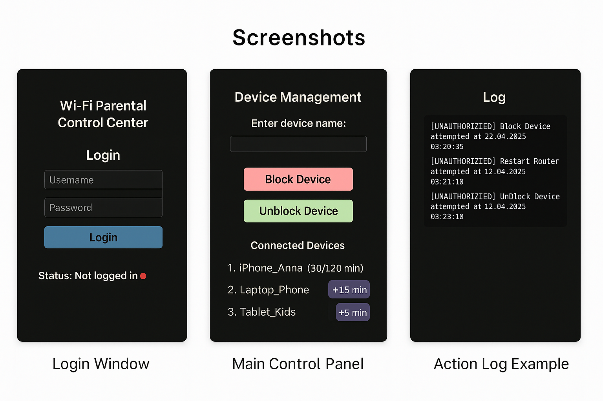

# wifi-parental-control
A Python desktop app to control internet access for kids

A simple and intuitive desktop application to help parents manage internet usage for connected devices at home.

🚀 Features:

User login system

Device blocking/unblocking

Daily usage time limits per device

Automatic daily reset of usage data

Restart router command 

Unauthorized action logging

GUI built with Tkinter

💻 Technologies Used:

Python

Tkinter

datetime

file handling

🧠 Idea:

The goal of this project is to make internet usage safe and healthy for kids by providing parents with easy-to-use controls. It runs locally and doesn't require constant internet connection.

📂 How to Run:

python wifi_control.py

📌 Screenshots:

👩‍💻 Developer:

Created by Kateryna – Junior Python Developer on her learning journey 🌟

🌐 GitHub Pages Link:

👉 [Open Project in Browser](https://kateryna-se.github.io/wifi-parental-control/)

Stay connected, stay in control! ☀️

